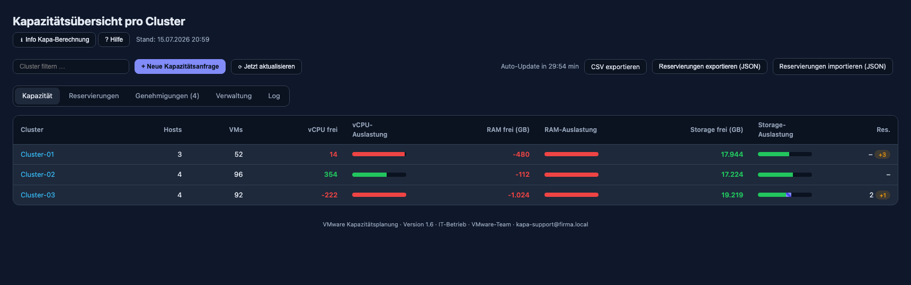
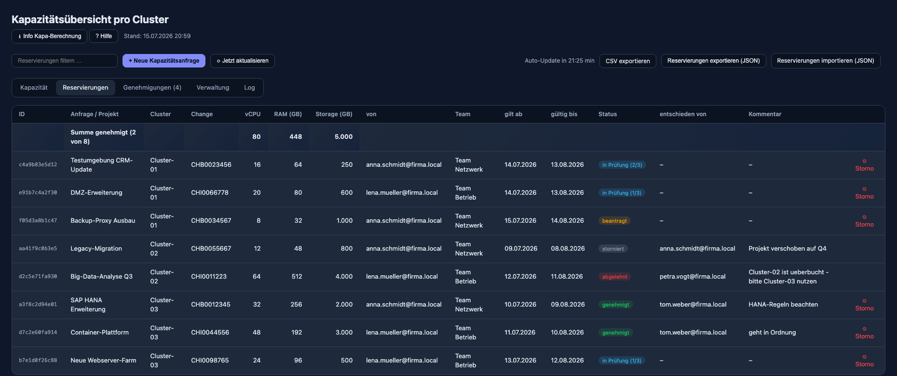
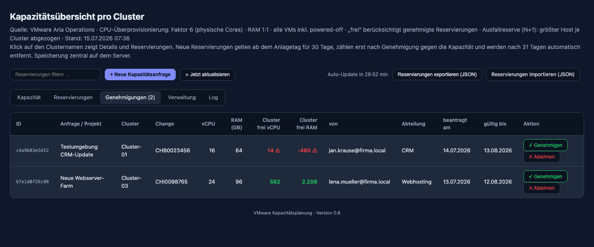
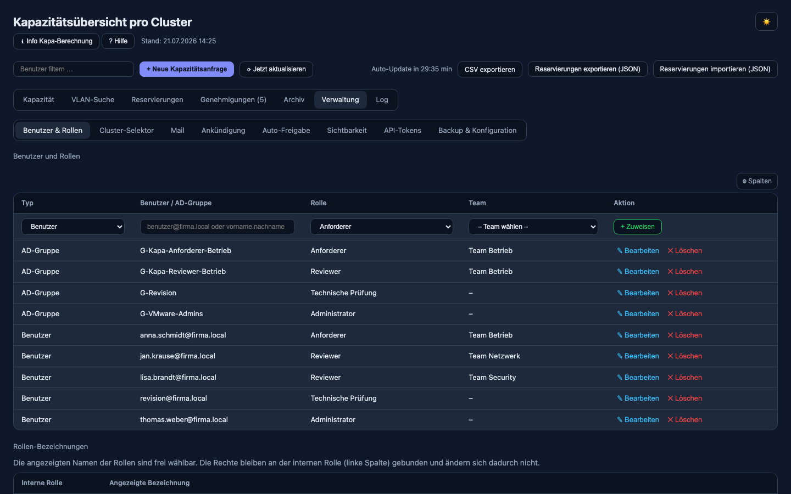
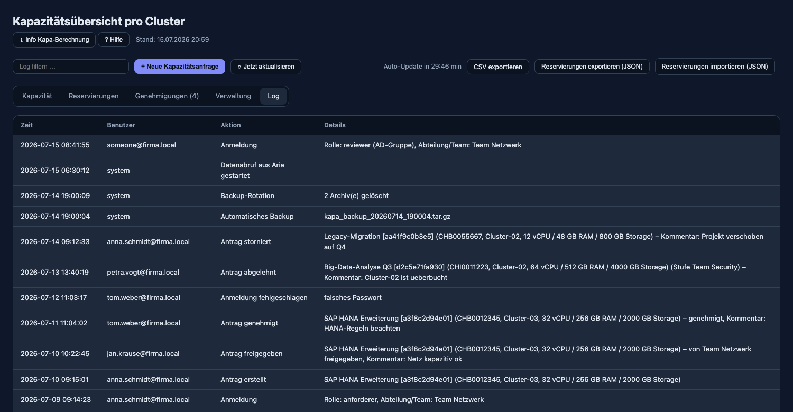
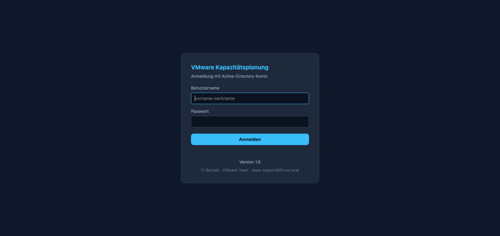

# VMware Kapazitätsplanung (Aria Operations)

> 🇬🇧 [English version: README.en.md](README.en.md)

Kapazitätsauswertung pro Cluster aus VMware Aria Operations mit browserbasiertem
Dashboard und Reservierungsfunktion für künftige Kapazitätsanfragen.



*Kapazitätsübersicht mit Demo-Daten: freie vCPU-, RAM- und Storage-Kapazität je
Cluster mit Auslastungsbalken, Quellen-Badge (mehrere vROps), vROps-Quickfilter
im Selektor und Spalten-Konfiguration (`python3 aria_kapa.py --sample --serve`).*

## Funktionsüberblick

Ein einzelnes Python-Skript (nur Standardbibliothek, **kein pip, kein Build**),
das die Aria-Operations-Daten als Web-Dashboard aufbereitet. Die
**Oberflächensprache folgt dem Browser**: Deutsch bleibt Deutsch, jede andere
Browsersprache bekommt Englisch — inklusive Login, **API-Doku/OpenAPI-Spec**
und **CSV-Export** (Spaltennamen/Statuswerte per `Accept-Language` bzw.
`?lang=de|en`). Stabil deutsch bleiben die JSON-API-Felder und -Statuswerte
(v1-Vertrag), das Audit-Log und die gespeicherten Daten.

**Kapazität & Auswertung**
- **Mehrere benannte vROps-Quellen** (optional): 1–3 (oder mehr) Aria-Operations-Systeme, je mit/ohne Proxy, gemischt zu einer Übersicht; jeder Cluster trägt ein Quellen-Badge (Voraussetzung: eindeutige Cluster-Namen). Auch die **einzelne Quelle** aus `[kapa]` lässt sich per `source-name` benennen
- Freie **vCPU / RAM / Storage** je Cluster mit Auslastungsbalken; frei = Kapazität − belegt − genehmigte Reservierungen
- **N+1-Ausfallreserve** (`--failover-hosts`), **vSAN-Faktor** für nutzbare Netto-Kapazität, VM-**Ausschluss per Tag**
- **Storage-Drilldown** je LUN/Datastore (sortierbar), **vSphere-Tags** je Cluster
- **Workload %** je Cluster aus vROps (für Anforderer verborgen — auch serverseitig)
- **Tanzu-/Kubernetes-Namespaces**: CPU-/RAM-**Reservierungen der vSphere-Namespaces**
  zählen automatisch gegen die freie Kapazität (wie genehmigte Reservierungen);
  Drilldown je Cluster, `tanzu-mhz-per-vcpu` für die MHz→vCPU-Umrechnung
- **Cluster-Selektor**: vROps-Quellen-Filter + bis zu 3 kaskadierende Tag-Filter; **Filter-/Suchfelder**, **sortierbare Tabellen**
- **Spalten ein-/ausblenden** in allen Datentabellen („⚙ Spalten", je Benutzer gespeichert)
- **Auto-Aktualisierung** mit geschätztem Prozent-Fortschritt; Export als **CSV/JSON**

**Netzwerk & VLAN**
- **Netzwerk-Reiter** je Cluster: Portgruppen mit VLAN-Nummern, direkt durchsuchbar
- **VLAN-Suche** über alle Cluster (IP/Netz/Name → an welchem Cluster hängt es)
- **Uplink-/Trunk-Portgruppen** (VLAN 0-4094) werden ausgeblendet (`--show-uplink-portgroups`)

**Reservierungen & Genehmigungs-Workflow**
- Kapazitätsanfragen mit optionalem **Change/Jira-Ticket**; eigene Reservierungsseite mit **Suchmaske** und Summenzeile; **Kapa-ID-Format konfigurierbar** (`id-prefix`/`id-length`)
- **Mehrstufige Genehmigung** über Teams (Prüfreihenfolge), Freigabe/Ablehnung/Storno, Status-Historie
- **Archiv** für abgelehnte/stornierte Anfragen (eigener Menüpunkt, dauerhaft, gleiche Team-Sichtbarkeit)
- Automatischer **Ablauf** nach `--res-ttl-days`; Warnung, wenn eine Anfrage die freie Kapazität übersteigt

**Rollen, AD & Sicherheit**
- Rollen **Admin / Reviewer / Anforderer / Auditor**, frei benennbar; team-basierte Sichtbarkeit
- **AD-Anmeldung** (LDAP, nur Stdlib), **AD-Gruppen** als Berechtigungssubjekt, Empfänger-Mail aus wählbarem **AD-Attribut**
- Härtung: CSP/Security-Header, `Secure`-Cookies, **Login-Bremse**, Stored-XSS-sicheres Rendering

**Mail-Benachrichtigungen**
- Pro interner Rolle konfigurierbar: **Anlage / Ablehnung / Freigabe / „Team ist dran" / Erinnerung**
- **Erinnerungs-Mails** für liegengebliebene Anträge: wartet ein Antrag länger als
  x Tage (einstellbar, Standard 2) auf seine aktuelle Freigabe-Stufe, wird das
  zuständige Team (und/oder der Admin-Verteiler) erinnert — danach alle x Tage
  erneut, bis entschieden ist
- Empfänger gemischt: Antragsteller automatisch, Admin/Auditor per Verteiler, Teams per eigener Adresse
- Dezente **HTML-Mails** (+ Klartext-Fallback)
- **Editierbare Mail-Vorlage** (Verwaltung → Mail): Betreff + HTML frei anpassbar mit
  `{{platzhaltern}}` (Klick fügt sie an der Cursor-Position ein), **Live-Vorschau** mit
  Beispieldaten in einem sandboxed iframe, „Standard einsetzen"; leer = eingebaute Vorlage

**Verwaltung (Admin-UI)**
- Unter-Reiter **Benutzer & Rollen / Cluster-Selektor / Mail / Ankündigung / API-Tokens / Backup & Konfiguration**
- **Ankündigungs-Popup**: Admins veröffentlichen bei Bedarf eine Ankündigung
  (Titel + Text, aktivierbar) — jeder Benutzer sieht sie **einmal** nach der
  Anmeldung („Verstanden"-Merker je Benutzer); Textänderung zeigt sie allen
  erneut. Ideal für Release-News, neue Datacenter oder Wartungsfenster
- **Schreibgeschütztes Konfig-Sheet** (alle gesetzten Werte, Passwörter nur als „gesetzt: ja/nein")
- **API-Tokens** für die v1-REST-API; **Schreibrechte je Token per Klick**
  (Reservierungen anlegen/stornieren, Genehmigen/Ablehnen), Backup-auf-Knopfdruck

**Betrieb & Technik**
- Datenhaltung als **JSON-Dateien oder SQLite** (`--storage`), **atomare** Schreibvorgänge
- **SFTP-Backup** mit Rotation, **Audit-Log** (JSONL, rotierend)
- **Eine INI** für alle nicht-geheimen Einstellungen, Geheimnisse als `.pass`-Dateien; optionaler **Aria-Proxy**
- Auslieferung als **systemd + nginx**, **RPM**, **Ansible** oder **Container** (fertiges Image auf **GHCR**, bei jedem Release automatisch gebaut)

Details zu jedem Bereich in den folgenden Abschnitten.

## Dashboard

- **Kompakte Tabellenansicht**: pro Cluster die freien **vCPU-, RAM- und
  Storage**-Kapazitäten (nach Abzug genehmigter Reservierungen) mit
  Auslastungsbalken. Die Erläuterungen zur Berechnung stehen hinter den Knöpfen
  „ℹ Info Kapa-Berechnung" und „? Hilfe".
- **Detailkarte in Reitern**: Klick auf den Clusternamen öffnet die Details,
  aufgeteilt in **CPU & RAM** (Auslastung, Kennzahlen, Reservierungen inkl.
  Antrags-Formular und darunter die **vSphere-Tags** des Clusters), **Storage**
  (Auslastung und jede LUN, sortierbar nach Größe/Belegung), **Netzwerk** (die
  Portgruppen des Clusters mit ihren VLAN-Nummern, **direkt im Reiter nach
  IP/VLAN/Name durchsuchbar**), **Hosts** und
  **VMs**. Ein Klick auf den Storage-Wert springt direkt in den Storage-Reiter.
  Die Karte ist breit angelegt und lässt sich unten rechts frei in der Größe
  ziehen.
- **VLAN-Suche** (Tab „VLAN-Suche" bzw. `/vlan-suche`, zwischen Kapazität und
  Reservierungen): durchsucht die Portgruppen **aller** Cluster. Weil die
  Portgruppen-Namen die IP-Netze enthalten, findet man über eine Teil-Eingabe
  (z. B. `10.2.30` oder `VLAN205`) sofort, **an welchem Cluster** ein Netz hängt.
  Ergebnis als sortierbare Tabelle Portgruppe / VLAN / Cluster.
- **Filterfeld** für Cluster bzw. Reservierungen (findet auch Change-Nummer,
  Anforderer, Team, Status und ID)
- **Cluster-Selektor**: Über der Kapazitätsliste blenden sich Schnellfilter
  ein. Bei mehreren vROps-Quellen steht **ganz vorn ein „vROps"-Filter** (der
  Quellenname aus der INI); ist nur eine Quelle konfiguriert, ist sie der
  Standard. Danach folgen bis zu drei **kaskadierende** Auswahllisten anhand der
  vSphere-Tags (z. B. Umgebung → Standort → Betreuung); die Tag-Werte richten
  sich nach der gewählten Quelle. Stufe 2 zeigt nur Werte, die zur Wahl in
  Stufe 1 passen. Welche
  Tag-Kategorien die Stufen bilden, konfigurierst du frei im Tab „Verwaltung"
  (Unterreiter „Cluster-Selektor"); pro Stufe lässt sich ein eigener
  **Anzeigename** vergeben (z. B. Kategorie „Standort" → Beschriftung
  „Rechenzentrum"). Gespeichert wird per Knopf „✓ Selektor speichern". Die
  Werte kommen live aus den Tags.
- **Sortierbare Tabellen**: Klick auf eine Spaltenüberschrift sortiert auf-/
  absteigend (numerisch, nach Datum oder Text) – in allen Datentabellen
  (Kapazität, Reservierungen, Genehmigungen, Log, Benutzer/Rollen, Tokens). Die
  Genehmigungs-Teams behalten ihre manuelle Prüfreihenfolge.
- **Spalten ein-/ausblenden**: Über den Knopf **„⚙ Spalten"** – in **allen
  Datentabellen** (Kapazität, Reservierungen, Genehmigungen, Archiv, Log,
  Benutzer/Rollen, API-Tokens, VLAN-Suche) – lassen sich einzelne Spalten aus-
  und wieder einblenden. Die Auswahl wird **pro Benutzer** gespeichert (angemeldet
  serverseitig, sonst lokal im Browser). Die kleinen Konfig-Tabellen mit fester
  Reihenfolge (Genehmigungs-Teams, Rollen-Bezeichnungen, Cluster-Selektor)
  behalten bewusst ihr Layout.
- **Eigene Reservierungsseite** (Tab „Reservierungen" bzw. `/reservierungen`)
  mit allen **aktiven** Kapazitätsanfragen, Status und Summenzeile (mit Suchfeld)
- **Genehmigungs-Dashboard** (Tab „Genehmigungen" bzw. `/genehmigungen`):
  offene Anträge genehmigen oder ablehnen
- **Archiv** (Tab „Archiv" bzw. `/archiv`): abgelehnte und stornierte Anfragen als
  Historie (durchsuchbar, zählt nicht gegen die Kapazität). Sie bleiben dauerhaft
  erhalten und tauchen nicht mehr in der aktiven Reservierungsliste auf.
  **Sichtbarkeit wie bei den Reservierungen**: Anforderer sehen die des eigenen
  Teams, Reviewer/Admin/Auditor alle.
- **Audit-Log** (Tab „Log" bzw. `/log`, nur Admins): protokolliert
  Anmeldungen (auch fehlgeschlagene), Anträge, Genehmigungen/Ablehnungen,
  Stornos, Importe, Rollenänderungen und Backups nach `data/kapa_log.jsonl`.
  Die Datei **rotiert automatisch** ab 10 MB (`.1` … `.3`), und die Ansicht
  liest nur das Dateiende – das Log kann also nicht unbegrenzt wachsen oder
  den Aufruf ausbremsen.
- **Export**: Reservierungen als **CSV** (Semikolon, direkt Excel-tauglich)
  oder als JSON über die Knöpfe in der Kopfleiste.
- **Auto-Aktualisierung** im Serve-Modus (Standard: alle 30 Minuten, sichtbarer
  Countdown) plus Knopf „⟳ Jetzt aktualisieren"

## Screenshots

Alle Aufnahmen mit Demo-Daten (`python3 aria_kapa.py --sample --serve`).

**Reservierungen** — alle Anfragen mit ID, Change-Nummer, Team, vCPU/RAM/Storage
und Status: `beantragt`, `in Prüfung (n/3)`, `genehmigt`, `abgelehnt` und
`storniert`. Jede Spalte ist per Klick sortierbar, „⦸ Storno" zieht eine Anfrage
zurück:



**Genehmigungen** — offene Anträge mit der freien Kapazität des Ziel-Clusters
(⚠ markiert Anträge, die nicht mehr hineinpassen), dem Fortschritt der
mehrstufigen Freigabe und der Schaltfläche für das jeweils zuständige Team:



**Verwaltung** (nur Admins) — Benutzer **und AD-Gruppen** mit Rolle und Team,
frei wählbare Rollen-Bezeichnungen und die Genehmigungs-Teams in ihrer
Prüfreihenfolge; Cluster-Selektor, Mail, Ankündigung, API-Tokens und
Konfiguration liegen in eigenen Unterreitern:



**Log** (nur Admins) — Audit-Log mit Anmeldungen, Anträgen, Freigaben,
Ablehnungen, Stornos und Backups:



**Anmeldung** mit Active-Directory-Konto:



## Berechnung

- **CPU-Kapazität** = Summe physischer Cores aller ESXi-Hosts im Cluster × Überprovisionierungsfaktor (Standard: 6)
- **RAM-Kapazität** = Summe physischer RAM aller Hosts (1:1)
- **Storage-Kapazität** = Summe der Kapazität aller an den Cluster-Hosts
  angedockten Datastores (vSAN **und** externe FC-LUNs). Die Zuordnung läuft
  über die Host-Beziehungen in Aria (Datastore → angedockte Hosts → Cluster);
  jeder Datastore zählt **je Cluster genau einmal**, auch wenn ihn alle Hosts
  sehen (kein Doppeln geteilter LUNs). Wird keine Kapazität geliefert, zeigt die
  Spalte „–". Der Abruf protokolliert im Log die zugeordneten Datastores, die
  Summe je Cluster und die erkannten Storage-Typen – hilfreich zur Kontrolle.
- **vSAN wird als nutzbare Kapazität gerechnet**: Weil vSAN spiegelt (RAID-1),
  zählt die Bruttokapazität nur anteilig. Der Faktor ist über `--vsan-factor`
  einstellbar (Standard `0.5`; `1` = brutto). Er wirkt auf **Kapazität und
  Belegung**, damit die Auslastung stimmt — vROps meldet beide Werte brutto.
  Die LUN-Liste zeigt den **Storage-Typ** (vSAN/VMFS/NFS) und bei vSAN die
  Bruttokapazität im Tooltip. Der Typ kommt aus den Datastore-Eigenschaften;
  wird keiner geliefert, greift die Erkennung über den Datastore-Namen.
  - **LUN-Detail**: Ein Klick auf den Storage-Wert (oder auf den Clusternamen)
    öffnet die Detailkarte mit **jedem einzelnen Datastore/LUN** – wahlweise
    sortiert nach **Größe** oder nach **Belegung**, mit Größe, belegtem Platz,
    Belegung in % und freiem Platz.
- **Ausfallreserve (N+1)**: pro Cluster wird der größte Host (Cores und RAM)
  von der Gesamtkapazität abgezogen (`--failover-hosts`, Standard: 1, `0` = aus);
  Storage bleibt davon unberührt.
- **Belegt** = provisionierte vCPUs / RAM aller VMs bzw. belegter Datastore-Platz (inkl. powered-off)
- **Frei** = Kapazität − belegt − genehmigte Reservierungen (für vCPU, RAM und Storage)
- **Ausschluss per Tag**: Mit `--exclude-tag Kapa_Filter:Ja` werden VMs mit dem
  angegebenen vROps-Tag (Kategorie:Wert) aus der Belegung herausgerechnet.
- **vSphere-Tags**: Die Tags des Clusters kommen aus den **Eigenschaften** der
  Ressource (`/resources/{id}/properties`) und werden in der Detailkarte
  (Reiter „CPU & RAM") als Chips angezeigt. Ohne weitere Angabe werden alle
  Eigenschaften übernommen, deren Schlüssel `tag` enthält; mit `--tag-property`
  lässt sich das auf ein Präfix eingrenzen (z. B. `summary|tag`).
  Enthält eine Eigenschaft **JSON** (z. B. `TagJson`), wird es aufgeschlüsselt
  und nur die Tags werden gelistet — rohes JSON erscheint nie in der Anzeige.
  Das Log nennt nach jedem Abruf die erkannten Schlüssel und einen Auszug des
  Rohwerts — praktisch zum Feinjustieren.
- **dvSwitches / Portgruppen**: Aria liefert die verteilten Switches
  (`VmwareDistributedVirtualSwitch`) und Portgruppen
  (`DistributedVirtualPortgroup`) als eigene Ressourcen. Die Zuordnung zum
  Cluster läuft — wie beim Storage — über die angedockten Hosts
  (dvSwitch → HostSystem → `summary|parentCluster`); die VLAN-Nummer wird best
  effort aus den Portgruppen-Eigenschaften gelesen (pro Portgruppe über
  `/resources/{id}/properties`, jeder Schlüssel mit „vlan" im Namen). Schlägt der
  Abruf fehl, bleibt der Netzwerk-Reiter leer und der Rest läuft weiter. Das Log
  meldet `dvSwitches: N, Portgruppen: M · zugeordnet: …` — dort nach dem nächsten
  Abruf gegenprüfen.
  **Uplink-/Trunk-Portgruppen** (Name enthält „uplink" oder VLAN ist eine breite
  Trunk-Range wie `0-4094`) sind keine echten Netz-VLANs und werden
  standardmäßig **ausgeblendet**; mit `--show-uplink-portgroups` lassen sie sich
  wieder einblenden.
- **Workload %**: Der vROps-Workload-Badge je Cluster (`badge|workload`) wird
  best effort mitgelesen und in der Cluster-Detailkarte als Kennzahl angezeigt –
  **für die Rolle Anforderer ausgeblendet** (weder im UI noch im Datenabruf).
  Log: `Cluster-Workload gelesen: N/M`.
- **Tanzu-/vSphere-Namespaces**: Läuft auf einem Cluster vSphere with Tanzu,
  werden die **Namespace-Reservierungen** (CPU/RAM) aus vROps gelesen und
  zählen — wie genehmigte manuelle Reservierungen — gegen die freie Kapazität.
  Die CPU-Reservierung kommt in **MHz** und wird über `tanzu-mhz-per-vcpu`
  (Standard 2500, `0` = CPU nicht zählen) in **vCPU-Äquivalente** umgerechnet
  (aufgerundet). Die Detailkarte zeigt einen eigenen Abschnitt
  „Tanzu-Namespaces" mit jedem Namespace (MHz, vCPU-Äquivalent, RAM) und die
  Kennzahl „davon Tanzu-Namespaces". Die Worker-VMs der TKG-Cluster sind als
  normale VMs ohnehin in der Belegung enthalten — die Namespace-Reservierung
  sichert zusätzlich zugesagte, noch nicht materialisierte Kapazität ab
  (bewusst konservativ). Der Abruf ist best effort: Resource-Kind und
  Stat-Keys variieren je vROps-Version, deshalb probiert das System Kandidaten
  durch und protokolliert das Ergebnis (`Tanzu: … Namespaces gefunden`,
  `erkannte Schlüssel: …`) — nach dem ersten Abruf gegen das echte vROps im
  Log gegenprüfen. Ohne Tanzu findet der Abruf nichts und ändert nichts.
- **Cluster-Detailkarte überall**: Ein Klick auf einen **Clusternamen** öffnet
  die Detailkarte – nicht nur in der Kapazitätsübersicht, sondern auch in den
  Reservierungen, Genehmigungen und der VLAN-Suche.
- Die Erläuterungen zur Berechnung und die Hilfe stehen im Dashboard hinter den
  Buttons **„ℹ Info Kapa-Berechnung"** und **„? Hilfe"** (aufgeräumte Kopfzeile).

## Verwendung

Nur Python 3.8+ nötig, keine Zusatzpakete — läuft damit direkt auf jedem Linux-Host.

**Server-Modus** (empfohlen): Seite lädt sofort aus dem Datei-Cache
(`data/kapa_cache.json`); beim allerersten Start ohne Cache werden die Daten
automatisch abgerufen. Danach Aktualisierung alle 30 Minuten oder per Knopf:

```bash
python3 aria_kapa.py --url https://aria-ops.firma.de --user admin --insecure --serve
# Dashboard: http://localhost:8080  ·  Reservierungen: http://localhost:8080/reservierungen
```

**Einmaliger Snapshot** (statisches HTML, Reservierungen dann nur im Browser):

```bash
python3 aria_kapa.py --url https://aria-ops.firma.de --user admin --insecure
```

**Demo ohne Aria-Verbindung:**

```bash
python3 aria_kapa.py --sample                # statisch
python3 aria_kapa.py --sample --serve        # Server-Modus
```

Eine fertig generierte Demo liegt als
[`kapa_dashboard_demo.html`](kapa_dashboard_demo.html) im Repo — herunterladen
und im Browser öffnen, ganz ohne Installation (Reservierungen landen dann nur
im localStorage des Browsers).

## Reservierungen (Kapazitätsanfragen)

Anlegen per Dialog („+ Neue Kapazitätsanfrage") oder direkt in der
Detailkarte eines Clusters; Export/Import als JSON.

- **Eindeutige ID**: Jede Anfrage erhält beim Anlegen automatisch eine
  eindeutige ID (12 Zeichen). Sie wird in den Tabellen „Reservierungen" und
  „Genehmigungen" als erste Spalte angezeigt und steht auch in der
  Report-Mail, im CSV-Export (`/api/v1/reservations?format=csv`) und im
  Audit-Log — so lässt sich jede Anfrage zweifelsfrei referenzieren.

- **Change / Jira-Ticket (optional)**: Jede Anfrage kann eine Change-Nummer oder
  ein Jira-Ticket tragen – frei wählbar, ohne festes Format und **kein
  Pflichtfeld**. Der Wert erscheint in den Übersichten und in der Report-Mail;
  fehlt er, steht dort „–".

- **Ressourcen**: Je Anfrage werden **vCPU**, **RAM (GB)** und **Storage (GB)**
  als **Ganzzahlen** erfasst (keine Kommazahlen). vCPU und RAM zählen gegen die
  berechnete Cluster-Kapazität; die Storage-Größe wird zur Anfrage geführt und
  überall mit angezeigt.
- **Gültigkeit**: Reservierungen gelten automatisch ab dem Anlagetag für
  30 Tage; das „gültig bis"-Datum wird in jeder Reservierung angezeigt.
- **Mehrstufiger Genehmigungsprozess**: Sind Teams konfiguriert, durchläuft
  jeder Antrag sie **nacheinander** in der festgelegten Reihenfolge. Der Status
  wandert von „beantragt" → „in Prüfung" (sobald das erste Team freigegeben hat)
  → „genehmigt" (erst wenn **alle** Teams freigegeben haben). Erst dann zählt
  der Antrag gegen die Kapazität. Beim Status **„in Prüfung"** zeigt ein
  Mouseover, welche Teams (mit Person und Datum) bereits freigegeben haben und
  welches Team als Nächstes dran ist. Ein Team kann erst freigeben, wenn es an
  der Reihe ist; jedes Team kann in seiner Stufe auch ablehnen. Ohne Teams
  bleibt es einstufig (Admin genehmigt direkt).
  - **Teams pflegen**: im Tab „Verwaltung" (Abschnitt „Genehmigungs-Teams")
    – hinzufügen, per ↑/↓ in die richtige Prüfreihenfolge bringen, **umbenennen**
    (✎, die Reihenfolge bleibt erhalten und zugewiesene Reviewer werden
    automatisch übernommen) und entfernen. Gespeichert in `data/kapa_teams.json`.
    Der Parameter `--approval-teams` dient nur noch zur **Erstbefüllung**, falls
    diese Datei noch nicht existiert.
  - **Reviewer einem Team zuordnen**: Bei der Rollenzuweisung (Abschnitt
    „Benutzer und Rollen") wird für die Rolle *Reviewer* das Team über eine
    **Auswahlliste** der vorhandenen Teams gesetzt. Nur so zugeordnete Benutzer
    dürfen in der jeweiligen Stufe freigeben (serverseitig erzwungen).
- **Genehmigungsübersicht** (Tab „Genehmigungen"): zeigt je Antrag die freie
  Kapazität des Ziel-Clusters (⚠ wenn er nicht mehr hineinpasst), den
  Fortschritt und – für das gerade zuständige Team bzw. Admins – die
  Freigabe-/Ablehnen-Schaltflächen.
- **Ablehnungen** bleiben 31 Tage (ab Ablehnung) als Historie sichtbar
  (Status „abgelehnt"; im Mouseover steht, in welcher Stufe abgelehnt wurde).
- **Storno**: Anfragen lassen sich nicht löschen, sondern **stornieren**. Das
  darf ein Admin, der Anforderer selbst oder **jemand aus derselben Abteilung**
  (Button „⦸ Storno" in der Reservierungsliste). Eine stornierte Anfrage bekommt
  den Status „storniert", bleibt als Historie erhalten und zählt nicht mehr
  gegen die Kapazität.
- **Kommentar**: Beim Freigeben/Ablehnen/Stornieren kann ein Kommentar
  (z. B. Begründung, **max. 64 Zeichen**) über einen schlanken Dialog erfasst
  werden; er erscheint in der Reservierungsübersicht und in der Report-Mail.
- **Entschieden von**: Die Übersicht zeigt, welcher Admin genehmigt bzw.
  abgelehnt hat — für Anforderer ist diese Information verborgen (Spalte und
  Datenfeld werden serverseitig entfernt); Admins und technische Prüfung
  sehen sie.
- **Mail-Benachrichtigungen** (SMTP-Server über `--smtp-server` vorausgesetzt):
  In der **Verwaltung** legst du je interner Rolle fest, bei welchem Ereignis
  eine Mail rausgeht — **Anlage**, **Ablehnung**, **Freigabe** (endgültige
  Genehmigung) und **„Team ist dran"** (ein Team ist im Freigabe-Workflow an der
  Reihe). Empfänger:
  - **Anforderer** → der jeweilige Antragsteller (automatisch). Als Adresse dient
    standardmäßig der Anmeldename (UPN); mit `--ad-mail-attribute mail` (o. Ä.)
    wird stattdessen ein frei wählbares **AD-Attribut** ausgelesen (Service-Konto
    `--ad-bind-dn` nötig; wird bei der Anmeldung aufgelöst und mit der
    Reservierung gespeichert),
  - **Admin/Auditor** → je eine frei eingetragene Verteiler-Adresse
    (Admin fällt auf `--smtp-to` zurück, falls das Feld leer bleibt),
  - **„Team ist dran"** → die pro Genehmigungs-Team hinterlegte Adresse.

  Die Mail enthält die Reservierungsdaten; der Versand läuft asynchron und
  best-effort (Fehler nur im Log). Beim **Anlegen** eines Antrags wird zusätzlich
  automatisch das erste Team benachrichtigt, nach jeder Freigabe das nächste.

  **Mail-Vorlage editieren:** Im selben Reiter lassen sich **Betreff** und
  **HTML-Text** der Mails frei anpassen. Verfügbare Variablen (z. B. `{{name}}`,
  `{{cluster}}`, `{{vcpu}}`, `{{ram_gb}}`, `{{approvals}}`, `{{von}}`, `{{action}}`)
  werden als anklickbare Chips angezeigt und an der Cursor-Position eingefügt; die
  Werte werden serverseitig HTML-escaped eingesetzt (Layout-HTML des Admins bleibt
  erhalten). „**Vorschau**" rendert die Vorlage mit Beispieldaten in einem
  isolierten `sandbox`-iframe, „**Standard einsetzen**" lädt die eingebaute Vorlage.
  Leere Felder = eingebaute Standardvorlage. Gespeichert wird in `kapa_mail.json`
  (kein Passwort), Änderungen landen im Audit-Log.
- **Serve-Modus**: Reservierungen liegen zentral auf dem Server in
  `data/kapa_reservierungen.json` — alle Nutzer sehen denselben Stand.
- **Statisches HTML**: Speicherung lokal im Browser (localStorage).
- **Automatischer Ablauf**: Reservierungen werden `--res-ttl-days` Tage nach
  Anlage automatisch gelöscht (Standard: 31, `0` = nie löschen); die angezeigte
  Gültigkeit endet einen Tag davor (30 Tage).

## Datenspeicher

Alle Schreibvorgänge erfolgen **atomar** (erst in eine Temp-Datei, dann
umbenennen), sodass ein Absturz mitten im Speichern keine halb geschriebene,
beschädigte Datei hinterlassen kann. Über `--storage` (bzw. `storage =` in der
INI) wird die Ablageform gewählt:

- **`json`** (Standard): Je Sammlung eine gut lesbare, notfalls von Hand
  editierbare `.json`-Datei im `--data-dir` (`kapa_reservierungen.json`,
  `kapa_rollen.json`, `kapa_teams.json` …). Für den üblichen Betrieb völlig
  ausreichend.
- **`sqlite`**: Eine einzelne `data/kapa.db` (SQLite steckt in der
  Python-Standardbibliothek — **kein** zusätzliches Modul, kein Server, kein
  Port). Reservierungen werden **inkrementell** geschrieben (nur die geänderte
  Zeile statt der ganzen Liste); die kleinen Sammlungen liegen als
  Schlüssel-Wert-Einträge in derselben Datei. Sinnvoll erst bei sehr vielen
  (mehrere Tausend) aktiven Reservierungen.

Beim **erstmaligen Umstellen** auf `sqlite` übernimmt das Dashboard vorhandene
JSON-Daten **einmalig automatisch** in die neue `kapa.db` (Rollen, Teams,
Selektor, Rollennamen, Tokens und alle Reservierungen). Die JSON-Dateien bleiben
als Sicherung liegen — ein Rückwechsel auf `json` ist damit jederzeit möglich.
Das Audit-Log (`kapa_log.jsonl`) und der Aria-Cache bleiben in beiden Modi
eigene Dateien.

## API für externe Anwendungen

Unter `/api/v1/` gibt es eine stabile REST-API für externe
Anwendungen (Grafana, CMDB, Reporting …). Admins erzeugen dafür im Tab
„Verwaltung" benannte Bearer-Tokens (werden nur einmal angezeigt, nur der
Hash wird gespeichert, einzeln widerrufbar, Nutzung im Audit-Log):

```bash
curl -H "Authorization: Bearer kapa_..." \
  "https://host/capa/api/v1/reservations?status=genehmigt&format=csv"
```

Endpunkte (lesend): `/api/v1/reservations` (Filter: `cluster`, `status`,
`abteilung`; `format=csv`), `/api/v1/data` (Cluster-Kapazitäten),
`/api/v1/status`. **Schreibend** (Schreibrechte je Token per Klick in der
Verwaltung, Audit-geloggt): `POST /api/v1/reservations` (anlegen) und
`…/{id}/cancel` mit Recht „Reservierungen", `…/{id}/approve` und
`…/{id}/reject` mit Recht „Genehmigungen" — Details in
[`config/API.md`](config/API.md).

**Sprache:** Die JSON-Feldnamen und Statuswerte sind Teil des stabilen
v1-Vertrags und bleiben deutsch. **CSV-Spalten/Statuswerte** und die
**OpenAPI-Beschreibungen** folgen dagegen `Accept-Language` (bzw. explizit
`?lang=de|en`) — Aufrufe ohne Header (curl, Skripte) bekommen unverändert
Deutsch, bestehende Consumer sehen keine Änderung.

**Interaktive Doku im Dashboard**: unter **`/api/v1/docs`** (auch verlinkt im Tab
„Verwaltung → API-Tokens") – eine selbst-enthaltene, offline lauffähige
Swagger-artige Seite mit „Ausführen"-Knopf je Endpunkt. Die maschinenlesbare
**OpenAPI-3.0-Spec** liegt unter **`/api/v1/openapi.json`** und lässt sich in
Swagger Editor, Postman o. Ä. importieren. Textfassung: [`config/API.md`](config/API.md).

## Rollenkonzept und AD-Anmeldung

Mit `--ad-url` verlangt der Serve-Modus eine Anmeldung mit dem
Active-Directory-Konto (LDAP Simple Bind, nur Standardbibliothek):

```bash
python3 aria_kapa.py --url https://aria-ops.firma.de --user svc-aria --serve \
  --ad-url ldaps://dc01.firma.local --ad-domain firma.local \
  --admin-user vorname.nachname@firma.local
```

| Rolle | Rechte |
|---|---|
| **Anforderer** | Kapazitätsanfragen stellen; eigene, noch offene Anträge zurückziehen; sieht nur Anfragen der **eigenen Abteilung**, nicht wer entschieden hat |
| **Reviewer** | Mitglied eines Genehmigungsteams; gibt Anträge frei bzw. lehnt sie ab, **wenn das eigene Team an der Reihe ist** (Tab „Genehmigungen"); sieht alle Anträge, aber keine Verwaltung/Log |
| **Administrator** | Anträge in jeder Stufe genehmigen/ablehnen (mit Kommentar), Daten aus Aria aktualisieren, alle Reservierungen verwalten, Import, Rollen/Teams pflegen (Tab „Verwaltung"); sieht alles |
| **Technische Prüfung** | Alle Daten und Seiten einsehen — keinerlei Änderungen möglich |

- **Rollen zuweisen**: Tab „Verwaltung" (`/verwaltung`) — AD-Benutzernamen
  eintragen, Rolle wählen und im Feld „Abteilung / Team" bei **Anforderern** die
  das **Team** (eines der im selben Tab gepflegten Genehmigungs-Teams, per
  Auswahlliste) angeben – für **Anforderer und Reviewer** gleichermaßen; Admin
  und Auditor brauchen kein Team. Gespeichert in `data/kapa_rollen.json`.
  Bestehende Zuweisungen lassen sich per Klick bearbeiten oder entfernen.
- **Team-Sicht (nur Anforderer)**: Ein **Anforderer** sieht in der
  Reservierungsliste nur die Anfragen des **eigenen Teams** (fremde genehmigte
  bleiben anonymisiert als „(anderes Team)" enthalten, damit die freie
  Kapazität stimmt). **Reviewer, Admin und Auditor sehen alle** Anfragen – der
  mehrstufige Genehmigungsprozess bleibt dadurch unberührt.
- **Standardrolle**: Jeder erfolgreich am AD angemeldete Benutzer **ohne**
  explizite Zuweisung gilt automatisch als **Anforderer** — er kann Anfragen
  stellen, aber nichts freigeben. Reviewer-, Admin- und Auditor-Rechte gibt es
  nur über eine ausdrückliche Zuweisung.
- **AD-Gruppen berechtigen**: In der Verwaltung lässt sich (Typ „AD-Gruppe")
  auch einer ganzen **AD-Gruppe** eine Rolle (und ein Team) zuweisen — genau wie
  einem Benutzer. Jedes Mitglied der Gruppe erhält dann diese Rolle. Dafür ist
  ein **Service-Konto** nötig (`--ad-bind-dn`/`--ad-bind-password`/`--ad-base-dn`),
  mit dem das System nach der Anmeldung die AD-Gruppen (`memberOf`) des Benutzers
  sucht. Direkt zugewiesene Benutzerrollen haben Vorrang; bei mehreren Gruppen
  gewinnt die höchste Berechtigung.
- **Rollen-Bezeichnungen umbenennen**: Die angezeigten Namen der vier Rollen
  sind im Tab „Verwaltung" (Abschnitt „Rollen-Bezeichnungen") **frei wählbar**
  (z. B. „Anforderer" → „Antragsteller"), gespeichert in
  `data/kapa_rollennamen.json`. Die internen Rollen-Schlüssel und damit die
  **Rechte bleiben unverändert** — nur die Anzeige ändert sich.
- **Abteilungssicht**: Anforderer sehen nur Anfragen ihrer Abteilung.
  Fremde *genehmigte* Reservierungen bleiben anonymisiert als
  „(andere Abteilung)" sichtbar, damit die freie Kapazität stimmt;
  fremde offene/abgelehnte Anträge sind komplett ausgeblendet.
- **Bootstrap**: `--admin-user` (kommagetrennt) definiert Immer-Admins,
  damit der erste Admin die Verwaltung öffnen kann.
- Benutzernamen ohne `@` werden automatisch um `--ad-domain` ergänzt
  (`max` → `max@firma.local`).
- Alle Rechte werden **serverseitig** geprüft; die Oberfläche blendet
  nicht erlaubte Aktionen zusätzlich aus.
- `ldaps://` verwenden — bei `ldap://` gehen Passwörter unverschlüsselt
  über das Netz (`--ad-insecure` für Self-Signed-Zertifikate).
- Ohne `--ad-url` läuft alles wie bisher ohne Anmeldung (Vollzugriff).

### Härtung

- **Session-Cookie** mit `HttpOnly`, `SameSite=Lax` und `Secure`. Da das
  Dashboard hinter dem HTTPS-nginx läuft, ist `Secure` Standard; nur für
  einen lokalen HTTP-Test ohne Proxy lässt es sich mit `--cookie-insecure`
  abschalten.
- **Sicherheits-Header** auf jeder Antwort: `Content-Security-Policy`,
  `X-Frame-Options: DENY` (kein Clickjacking), `X-Content-Type-Options: nosniff`,
  `Referrer-Policy: same-origin`.
- **Ausgabe-Escaping**: aus Aria stammende Namen (Cluster, Hosts, VMs) werden
  script-tag-sicher eingebettet, sodass sie kein JavaScript einschleusen können.
- **Login-Bremse**: nach 5 Fehlversuchen je Benutzer/IP wird die Anmeldung für
  einige Minuten mit `429` gesperrt (Schutz vor Password-Spraying). Eine
  einheitliche Fehlermeldung verrät nicht, welche Konten berechtigt sind.
  AD-Ausfälle zählen dabei bewusst nicht als Fehlversuch.
- **Request-Größe** ist begrenzt (2 MiB), damit ein großer Body den Dienst
  nicht überlasten kann.

## Konfiguration (ein einfaches Modell)

Es gibt bewusst **eine** Konfigurationsdatei und ein klares Prinzip — jede
Einstellung hat **genau eine Quelle**:

| Was | Wohin |
|---|---|
| **Alle nicht-geheimen Einstellungen** (Aria-URL/-User, Berechnung, Netzwerk, Mail-Server, Backup-Ziel, AD-Verbindung, Server-Port …) | **`kapa.ini`** (Vorlage: [`config/kapa.ini.example`](config/kapa.ini.example)) |
| **Geheimnisse** (Passwörter, SSH-Key) | eigene **`.pass`-Dateien** (root:kapa, `0640`); die INI nennt nur den **Pfad** (`password-file`, `ad-bind-password-file`, …) |
| **Fachdaten** (Rollen, Teams, Mail-Regeln, Selektor, Tokens) | **Admin-UI** → Data-Store unter `--data-dir` |

```bash
python3 aria_kapa.py --config /etc/kapa/kapa.ini --serve
```

Die systemd-Unit ruft genau das auf — es gibt **keine `kapa.env`** mehr, die
Werte überschreiben könnte. Kommandozeilen-Argumente überschreiben die INI (für
Ad-hoc-Tests); unbekannte Schlüssel werden mit Fehlermeldung abgewiesen. Die im
System gesetzten Werte sind im Admin-UI unter **„Backup & Konfiguration"**
schreibgeschützt einsehbar (Passwörter nur als „gesetzt: ja/nein").

> Migration von älteren Versionen (kapa.env + KAPA_EXTRA_ARGS): Werte aus der
> `kapa.env` in die `kapa.ini` übernehmen, Passwörter in `.pass`-Dateien legen
> und deren Pfade in der INI eintragen, dann die vereinfachte Unit einspielen.
> `kapa.env` wird nicht mehr benötigt (Details: [`config/kapa.env.example`](config/kapa.env.example)).

**SFTP-Backup**: Mit `--backup-target backup@srv:/backup/kapa` werden die
Datendateien (Reservierungen, Rollen, Audit-Log, Cache) regelmäßig als
`tar.gz` per scp übertragen — Standard: **zweimal täglich**
(`--backup-interval 43200`). **Rotation**: Archive älter als 30 Tage werden
auf dem Ziel automatisch gelöscht (`--backup-keep-days`, per sftp, auch auf
sftp-only-Servern). Authentifizierung bevorzugt per SSH-Key (`--backup-key`);
ein Passwort (`--backup-password` bzw. `BACKUP_PASSWORD`) funktioniert nur
mit installiertem `sshpass`. Admins können ein Backup jederzeit **manuell
auslösen** – im Tab „Verwaltung" (Abschnitt „Backup") per Knopf oder direkt über
`POST /api/backup`. Ergebnisse (auch Fehler) landen im Audit-Log.

**Restore**: Schritt-für-Schritt-Anleitung in
[`config/RESTORE.md`](config/RESTORE.md).

## Optionen

| Option | Beschreibung |
|---|---|
| `--config kapa.ini` | Alle Optionen aus INI-Datei laden |
| `--cpu-factor 6` | CPU-Überprovisionierungsfaktor |
| `--failover-hosts 1` | Ausfall-Hosts pro Cluster (N+1), `0` = aus |
| `--auth-source local` | Auth-Quelle (z. B. AD-Quelle) |
| `--insecure` | TLS-Zertifikat nicht prüfen (Self-Signed) |
| `--aria-proxy http://proxy:3128` | optionaler HTTP(S)-Proxy für die Aria-Anfragen (abgesicherte Umgebungen) |
| `--serve --port 8080` | Webserver-Modus |
| `--bind 0.0.0.0` | Bind-Adresse für `--serve` |
| `--refresh-interval 1800` | Auto-Aktualisierung in Sekunden (`0` = aus) |
| `--data-dir /var/lib/kapa` | Basisordner aller Laufzeitdaten (Standard `data/`); bei CI/CD außerhalb des Deploy-Verzeichnisses wählen |
| `--cache kapa_cache.json` | Datei-Cache der letzten Abfrage |
| `--res-file data/kapa_reservierungen.json` | Reservierungsdatei (Serve-Modus) |
| `--res-ttl-days 31` | Reservierungen nach N Tagen löschen (`0` = nie) |
| `--id-prefix KAPA-`, `--id-length 12` | Aufbau der Kapa-ID: Präfix + N zufällige Hex-Zeichen |
| `--exclude-tag Kapa_Filter:Ja` | VMs mit diesem vROps-Tag (Kategorie:Wert) aus der Auswertung ausschließen |
| `--contact-info "…"` | Kontakt-/Impressumszeile (Footer + Login) für Rückfragen |
| `--ad-bind-dn`, `--ad-bind-password`, `--ad-base-dn` | Service-Konto für die AD-Gruppen-Berechtigung (memberOf-Suche) |
| `--approval-teams "A,B,C"` | **Erstbefüllung** der Genehmigungs-Teams (nur wenn `--teams-file` noch fehlt); danach Pflege im Tab „Verwaltung" |
| `--teams-file data/kapa_teams.json` | Datei mit den Genehmigungs-Teams (Pflege über die Verwaltungsseite) |
| `--rolenames-file data/kapa_rollennamen.json` | Datei mit den frei wählbaren Rollen-Bezeichnungen (Pflege über die Verwaltungsseite) |
| `--ad-url ldaps://dc01…` | AD-Anmeldung aktivieren |
| `--ad-domain firma.local` | Domäne für Benutzernamen ohne `@` |
| `--ad-insecure` | LDAPS-Zertifikat nicht prüfen |
| `--cookie-insecure` | Session-Cookie ohne `Secure` (nur lokaler HTTP-Test) |
| `--admin-user a@…,b@…` | Immer-Admins (Bootstrap) |
| `--roles-file data/kapa_rollen.json` | Rollendatei |
| `--smtp-server mail.firma.local:25` | Mailserver für Reports |
| `--smtp-from`, `--smtp-to` | Absender / Report-Empfänger (kommagetrennt) |
| `--smtp-user`, `--smtp-password`, `--smtp-tls` | SMTP-Anmeldung / STARTTLS |
| `--backup-target user@srv:/pfad` | SFTP/SCP-Backupziel |
| `--backup-key`, `--backup-password` | SSH-Key (empfohlen) bzw. Passwort (braucht sshpass) |
| `--backup-port 22`, `--backup-interval 43200` | SSH-Port / Backup-Intervall in s (2×/Tag) |
| `--backup-keep-days 30` | Rotation: ältere Archive auf dem Ziel löschen |
| `--password-file datei` | Aria-Passwort aus `.pass`-Datei (Pfad gehört in die INI) |
| `--ad-bind-password-file`, `--smtp-password-file`, `--backup-password-file` | dito für AD-Service-Konto / SMTP / Backup |
| `--log-file data/kapa_log.jsonl` | Audit-Log-Datei |
| `--tokens-file data/kapa_tokens.json` | API-Token-Datei |
| `--output datei.html` | Ausgabedatei (statischer Modus) |
| `--json datei.json` | Rohdaten zusätzlich als JSON |

Alle JSON-Datendateien (Cache, Reservierungen, Rollen, Teams, Log, Tokens,
`--json`-Export) liegen standardmäßig im Ordner `data/`, der komplett per
`.gitignore` vom Repository ausgeschlossen ist. Der Basisordner ist über
`--data-dir` frei wählbar; explizite Pfade (z. B. `--cache /pfad/cache.json`)
werden respektiert.

> **Wichtig bei CI/CD (GitLab-Pipeline o. Ä.):** Legt die Laufzeitdaten mit
> `--data-dir` **außerhalb** des Deploy-Verzeichnisses ab (z. B.
> `/var/lib/kapa`). `data/` ist gitignored, also im Repository/Artefakt nicht
> enthalten. Deployt die Pipeline den Code über das Zielverzeichnis (per
> `git clean -fdx`, `rsync --delete` oder „Verzeichnis leeren und neu
> befüllen"), löscht sie damit den mitliegenden `data/`-Ordner bei **jedem**
> Deploy. Liegen die Daten unter `/var/lib/kapa`, bleiben sie unberührt. Die
> mitgelieferte systemd-Unit ist bereits so konfiguriert.

## Betrieb auf einem Linux-Host (systemd + nginx)

Fertige Vorlagen liegen unter [`config/`](config/):

- **`config/kapa-dashboard.service`** — systemd-Unit: läuft als eigener
  Benutzer `kapa` unter `/opt/kapa`, bindet nur an `127.0.0.1:8080`,
  Neustart bei Fehlern, gehärtete Sandbox. Ruft schlicht
  `--config /etc/kapa/kapa.ini --serve` auf (kein `EnvironmentFile`, keine
  `${VARS}`). Installationsschritte stehen als Kommentar in der Datei.
- **`config/kapa.ini.example`** — die eine Konfigurationsdatei
  (`/etc/kapa/kapa.ini`, Mode 640): Aria, Berechnung, Netzwerk, Server, AD,
  Mail, Backup. Empfehlung: eigenes **Nur-Lese-Servicekonto** in Aria
  Operations verwenden – das Skript liest ausschließlich.
- **Passwörter als eigene `.pass`-Dateien** (root:kapa, `0640`); die INI nennt
  nur den Pfad. Beispiel Aria (analog `ad_bind.pass`, `smtp.pass`, `backup.pass`):
  ```bash
  sudo sh -c 'echo "DAS-ARIA-PASSWORT" > /etc/kapa/aria.pass'
  sudo chown root:kapa /etc/kapa/aria.pass && sudo chmod 640 /etc/kapa/aria.pass
  ```
  dann in der INI `password-file = /etc/kapa/aria.pass` setzen. So taucht das
  Passwort weder in `ps aux` noch in `systemctl show` auf. Rangfolge überall:
  Parameter > Passwort-Datei > Umgebungsvariable (`ARIA_PASSWORD` usw. als
  optionaler Rückfall, siehe `config/kapa.env.example`).
- **`config/nginx-kapa.conf`** — Snippet für den bestehenden 443er-Server:
  stellt das Dashboard unter `https://<host>/capa/` bereit (Redirect
  `/capa` → `/capa/`, Prefix-Stripping, Cookie-Pfad). Die Weboberfläche
  nutzt relative API-Pfade und funktioniert daher unverändert unter dem
  Unterpfad. Einbinden per `include`, dann `nginx -t && systemctl reload nginx`.

Ohne `--ad-url` hat der eingebaute Webserver keine Authentifizierung — dann
nur im vertrauenswürdigen Verwaltungsnetz betreiben. TLS übernimmt der
Reverse-Proxy; das Dashboard selbst spricht nur HTTP auf localhost.

Die laufende Version wird im Footer der Weboberfläche und per
`aria_kapa.py --version` angezeigt.

### Auslieferung: RPM, Ansible/AAP, Container

Neben der manuellen Installation aus `config/` gibt es fertige
Deployment-Varianten unter [`deploy/`](deploy/) – dasselbe Skript, drei
Verpackungen:

- **[`deploy/rpm/`](deploy/rpm/)** — natives RPM für RHEL/Alma/Rocky 9
  (`dnf install`/`upgrade`, Dienst-Benutzer, systemd-Unit, Konfiguration unter
  `/etc/kapa` mit `noreplace`). `deploy/rpm/build.sh` baut das Paket, die
  Version kommt automatisch aus `aria_kapa.py`.
- **[`deploy/ansible/`](deploy/ansible/)** — Role + Playbook für den Rollout
  über eine Flotte bzw. die Ansible Automation Platform; installiert das RPM,
  pflegt die Konfiguration aus dem Vault und setzt den SELinux-Schalter
  `httpd_can_network_connect`.
- **[`deploy/docker/`](deploy/docker/)** — Container-Image auf Basis von Red Hat
  UBI 9 (läuft als nicht-root, auch mit Podman) samt `docker-compose.yml`.
  Bei jedem Release wird das Image automatisch gebaut und als **GitHub Package**
  veröffentlicht: `docker pull ghcr.io/marcobockelbrink/kapa-dashboard:latest`
  (amd64 + arm64, feste Versions-Tags wie `:1.30` für Rollbacks).

Details und die Auswahlhilfe stehen in [`deploy/README.md`](deploy/README.md).
