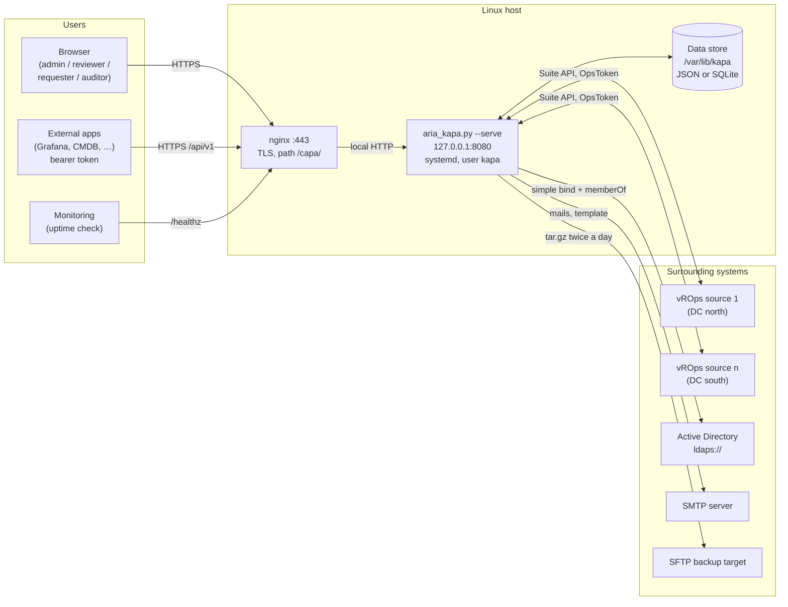
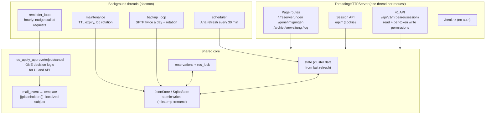
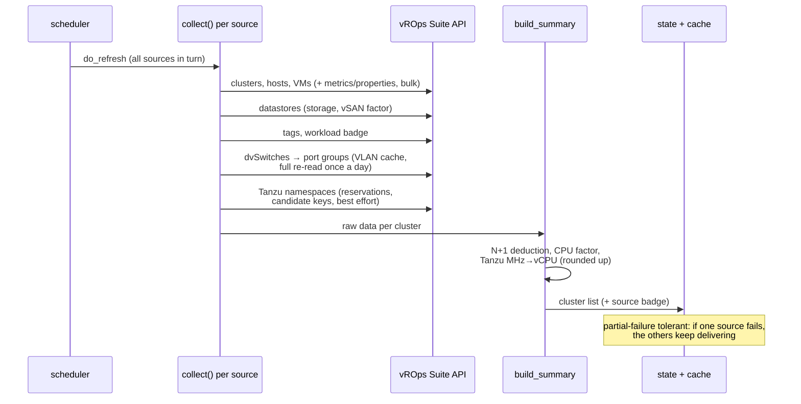
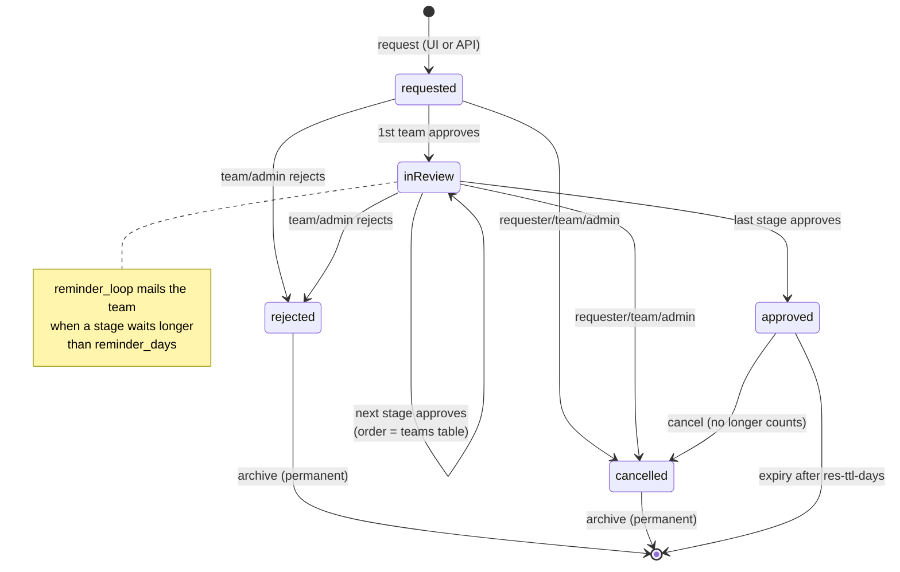
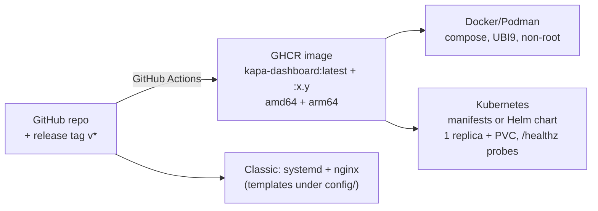

# Architecture — VMware Capacity Planning

> 🇩🇪 [Deutsche Fassung: ARCHITEKTUR.md](ARCHITEKTUR.md)
>
> As of v2.9. The diagrams are Mermaid — GitHub renders them right in the
> browser.

## Guiding idea

A **single Python script** (`aria_kapa.py`, standard library only,
Python 3.8+) is data collector, web server, calculation core and UI server in
one. No pip, no build, no database server — a deliberate choice so the
dashboard runs on any RHEL host without a package zoo and an update means
swapping **one file**.

**Trust boundaries:** TLS terminates at nginx; the dashboard itself speaks
local HTTP only. vROps access is strictly **read-only** (dedicated read-only
service account), optionally through a per-source proxy. Secrets never live
in the INI but in `.pass` files (root:kapa, 0640).

## Inside the process

Core rule since v2.8.1: **state transitions exist exactly once.** Session UI
and write API call the same `res_apply_*` functions — behavior cannot drift
(the refactor promptly surfaced a divergence bug: cancelled requests could
still be approved via the UI).

## Data flow: Aria refresh

Every step is **best effort**: if storage/network/Tanzu data is missing in an
environment, that part stays empty and the rest keeps working. The log states
per step what was detected (keys, mappings, cache hits) — version-dependent
vROps stat keys can be verified without code changes.

## Approval workflow

Optionally an **auto-approval** approves per-team-checked stages
automatically when the target cluster meets configured thresholds
(vCPU/RAM/largest LUN/workload) after subtracting the request — evaluated on
creation and stage changes, conservative (missing data blocks), fully
audited. Only the **approved** status counts against free capacity — together with the
automatically read **Tanzu namespace reservations**. Mails fire per event
according to the matrix in the administration (created/rejected/approved/
"team's turn"/reminder), rendered through the **editable HTML template**.

## Security at a glance

| Layer | Mechanics |
|---|---|
| Sign-in | LDAP simple bind (BER-encoded → no filter injection), empty password rejected, login throttle 5/5 min, password detector in the username field |
| Authorization | roles enforced server-side (requesters: team visibility, no workload, no "decided by"); reviewers only when their team is up |
| Sessions | `secrets.token_urlsafe(32)`, cookie `HttpOnly; Secure; SameSite=Lax` (CSRF protection), pruning on login |
| API | tokens stored as SHA-256 hash only, `hmac.compare_digest`, write permissions per token individually, everything audited |
| Output | strict CSP, `json_for_html` against `</script>` breakout, escaping of all foreign data, template preview in a sandboxed iframe |
| Operations | systemd sandbox (ProtectSystem=strict), files 0600 via mkstemp, request limit 2 MiB, gzip for text types only |

## Frontend

A single HTML page (embedded in the script as a template, data injected
server-side via `__PLACEHOLDERS__`), views via a `render()` dispatch (path or
hash). Cross-cutting engines live at the end of the script:

- **i18n**: German is the source; browser ≠ German → dictionary (~400
  entries) + regex patterns, a MutationObserver continuously translates text
  nodes **and** attributes. API values/status logic stay German (v1 contract).
- **Theme**: CSS variables, `data-theme="light"` on `<html>`, head snippet
  against flashing, choice stored in the per-user server prefs.
- **Prefs**: columns, "announcement seen", theme — one PUT replaces
  everything, hence `prefsBody()` always builds the full state.
- **Deep links**: `#cluster=Name` opens the detail card, the hash is set on
  opening.

## Data storage

All collections (reservations, roles, teams, selector, role labels, tokens,
mail rules, prefs, announcement) go through a store abstraction:
**JSON files** (default, one file per collection) or **SQLite** (a single
`kapa.db`, incremental reservation writes, automatic one-time migration).
Writes are always atomic. Details and restore:
[`../config/RESTORE.en.md`](../config/RESTORE.en.md).

## Deployment

Same artifact, container-first — decision guide in
[`../deploy/README.en.md`](../deploy/README.en.md).

## Deliberate decisions (mini ADRs)

1. **Standard library only, one file** — operations without package
   management, update = file swap; paid for with embedded templates.
2. **German as source language + translation engine** instead of duplicated
   templates — one source to maintain, EN follows automatically; the API
   stays stable German (v1 contract).
3. **Best-effort data collection with candidate keys** — vROps versions
   differ; better partially empty + well logged than failing hard.
4. **Tanzu counted conservatively** — namespace reservation on top of VM
   usage; possible double counting accepted in favor of safe planning.
5. **Cluster name as the key across sources** (variant A) — requires unique
   names; in return reservations survive source restructuring.
6. **Fail-fast configuration** — unknown INI keys and misplaced `[quelle:*]`
   entries abort startup with a hint instead of silently running on wrong
   defaults.
