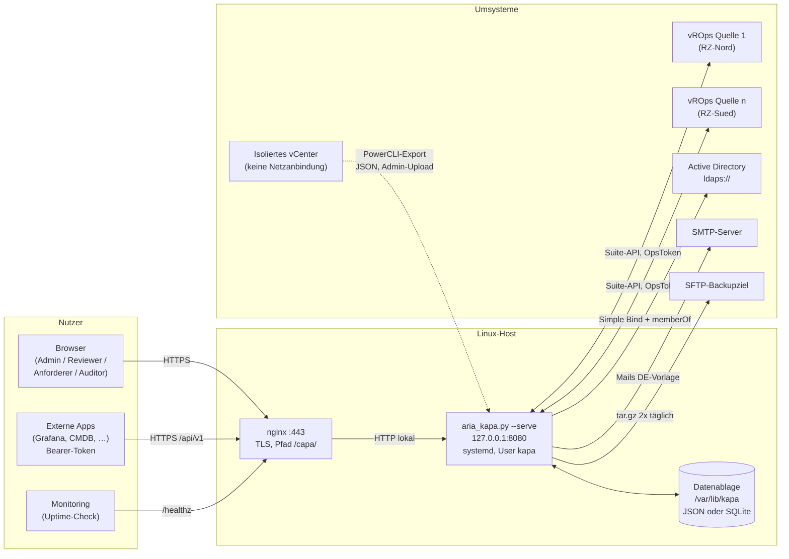
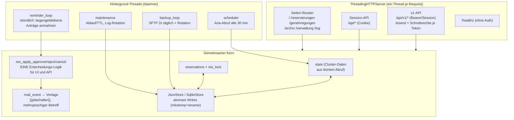
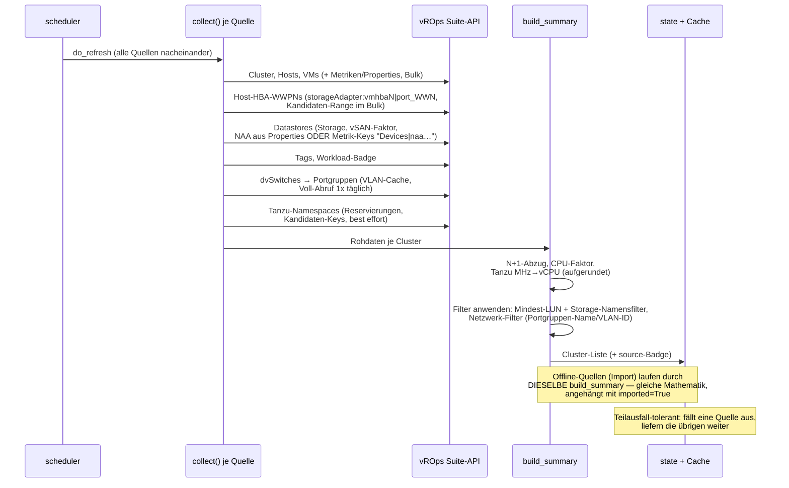
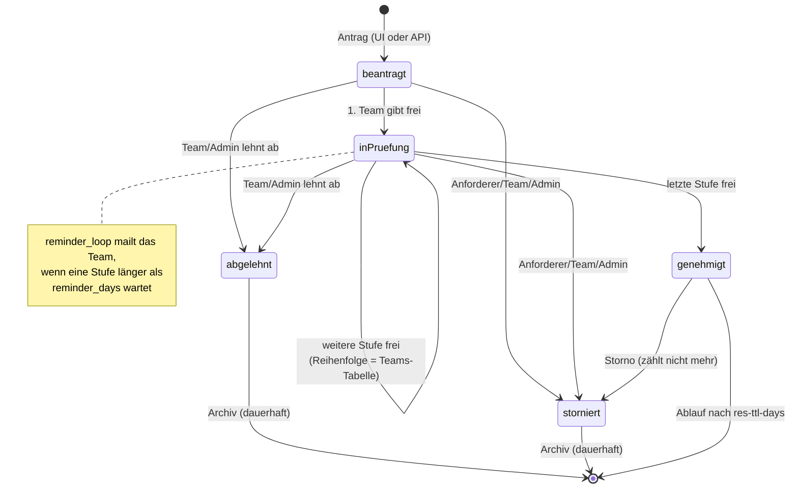
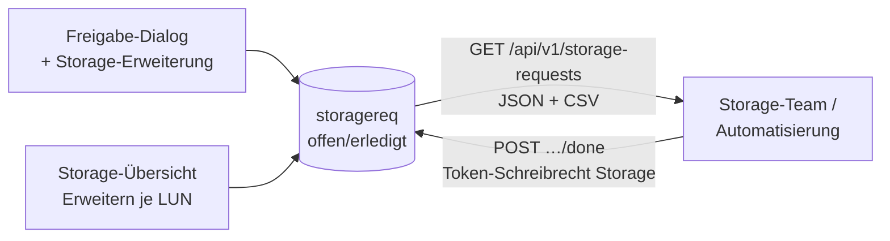
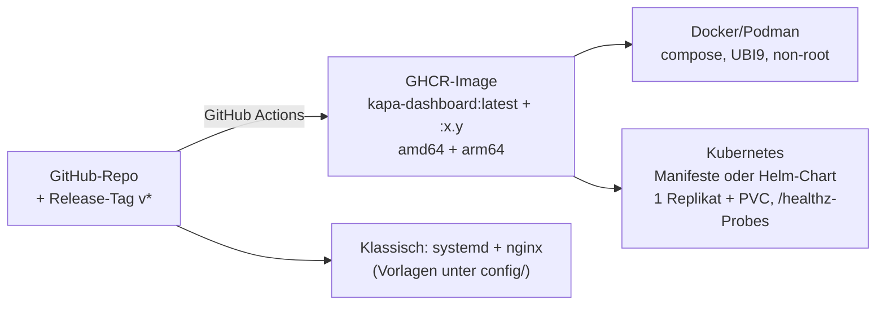

# Architektur — VMware Kapazitätsplanung

> 🇬🇧 [English version: ARCHITECTURE.en.md](ARCHITECTURE.en.md)
>
> Stand: v2.21. Die Schaubilder sind Mermaid-Diagramme — GitHub rendert sie
> direkt im Browser.

## Leitidee

Ein **einzelnes Python-Skript** (`aria_kapa.py`, nur Standardbibliothek,
Python 3.8+) ist zugleich Datensammler, Webserver, Rechenkern und UI-Auslieferer.
Kein pip, kein Build, keine Datenbank-Server — bewusst so gewählt, damit das
Dashboard auf jedem RHEL-Host ohne Paket-Zoo läuft und ein Update aus dem
Austausch **einer Datei** besteht.

**Vertrauensgrenzen:** TLS endet am nginx; das Dashboard spricht nur
lokales HTTP. Zugriff auf vROps ausschließlich **lesend** (eigenes
Read-only-Servicekonto), je Quelle optional über einen eigenen Proxy.
Secrets liegen nie in der INI, sondern in `.pass`-Dateien (root:kapa, 0640).

## Innenleben des Prozesses

Kernregel seit v2.8.1: **Zustandsübergänge existieren genau einmal.**
Session-UI und Schreib-API rufen dieselben `res_apply_*`-Funktionen —
Verhalten kann nicht auseinanderlaufen (der Refactor fand prompt einen
Divergenz-Bug: stornierte Anträge waren über die UI noch genehmigbar).

## Datenfluss: Aria-Abruf

Jeder Teilschritt ist **best effort**: Fehlt Storage/Netzwerk/Tanzu in einer
Umgebung, bleibt der jeweilige Teil leer und der Rest läuft weiter. Das Log
nennt je Schritt, was erkannt wurde (Schlüssel, Zuordnungen, Cache-Treffer) —
so lassen sich versionsabhängige vROps-Stat-Keys ohne Code-Änderung prüfen.

## Genehmigungs-Workflow

Optional gibt eine **Auto-Freigabe** je Team angehakte Stufen automatisch
frei, wenn der Ziel-Cluster nach Abzug des Antrags konfigurierte Schwellen
(vCPU/RAM/größte LUN/Workload) einhält — geprüft bei Antragstellung und
Stufenwechsel, konservativ (fehlende Daten blockieren), voll auditiert.
**Import-Cluster (Offline-Quellen) klammert sie grundsätzlich aus** — deren
Zahlen sind statisch, Anträge gehen dort immer an die Teams.
Erst der Status **genehmigt** zählt gegen die freie Kapazität — zusammen mit
den automatisch gelesenen **Tanzu-Namespace-Reservierungen**. Mails gehen je
Ereignis nach der Matrix in der Verwaltung (Anlage/Ablehnung/Freigabe/„Team
ist dran"/Erinnerung), gerendert über die **editierbare HTML-Vorlage**.
Für Reviewer verlinkt die Genehmigungs-Ansicht ein **Reviewer-Handbuch**
(eigene zweisprachige Doku-Seite unter `/reviewer-handbuch`).

## Storage-Erweiterungen (Brücke zum Storage-Team)

Freigebende können beim Genehmigen — oder Berechtigte ad-hoc in der
Storage-Übersicht — eine **LUN-Vergrößerung oder neue LUN** anfragen
(vSAN ausgenommen). Die Anfragen landen in einer eigenen Sammlung und werden
vom Storage-Team **per API** abgeholt:

Jede Anfrage trägt zur Identifikation alles Nötige: **NAA** der LUN, die
**ESXi-Hosts des Clusters samt FC-HBA-WWPNs** (fürs Zoning) und optional den
Bezug zur Kapazitätsanfrage. Admin-Regeln in der Verwaltung: Mindest-LUN-Größe
und Namensfilter (Anzeige), **Maximal-Größe je Anfrage** (Limit, server- und
clientseitig geprüft).

## Offline-Quellen (Cluster-Import ohne vROps)

Bereiche ohne Netzanbindung exportiert ein Kollege mit dem mitgelieferten
**PowerCLI-Skript** (Download in der Verwaltung → Import); das JSON wird
unter einem **festen Quellnamen** hochgeladen. Die Rohdaten (Hosts, VMs,
Datastores, Portgruppen mit VLAN-ID) laufen bei **jedem Abruf** durch dasselbe
`build_summary` wie echte Quellen — identische Kapazitäts-Mathematik und
Filter. Mehrere Quellen parallel; Re-Import ersetzt, Löschen entfernt die
Cluster mit dem nächsten Abruf. Das Import-Datum steht als Tag am Cluster;
`imported=True` markiert die Cluster intern (Auto-Freigabe-Ausschluss).

## Sicherheit in Kürze

| Ebene | Mechanik |
|---|---|
| Anmeldung | LDAP Simple Bind (BER-kodiert → keine Filter-Injection), leeres Passwort abgewiesen, Login-Bremse 5/5 min, Passwort-Detektor im Benutzerfeld |
| Autorisierung | Rollen serverseitig erzwungen (Anforderer: Team-Sicht, kein Workload, kein „entschieden von"); Reviewer nur, wenn ihr Team dran ist |
| Sessions | `secrets.token_urlsafe(32)`, Cookie `HttpOnly; Secure; SameSite=Lax` (CSRF-Schutz), Pruning beim Login |
| API | Tokens nur als SHA-256-Hash, `hmac.compare_digest`, Schreibrechte je Token einzeln zuschaltbar, alles auditiert |
| Ausgabe | Strikte CSP, `json_for_html` gegen `</script>`-Ausbruch, Escaping aller Fremddaten, Vorlagen-Vorschau im sandbox-iframe |
| Betrieb | systemd-Sandbox (ProtectSystem=strict), Dateien 0600 via mkstemp, Request-Limit 2 MiB, gzip nur für Text-Typen |

## Frontend

Eine einzige HTML-Seite (im Skript als Template eingebettet, Daten per
`__PLATZHALTER__` server-seitig injiziert), Views per `render()`-Dispatch
(Pfad oder Hash). Querschnittsfunktionen liegen als kleine Engines am
Skript-Ende:

- **i18n**: Deutsch ist Quelle; Browser ≠ deutsch → Wörterbuch (~500 Einträge)
  + Regex-Muster, ein MutationObserver übersetzt Textknoten **und** Attribute
  laufend. Elemente mit Inline-Auszeichnung (`<b>`/`<code>` mitten im Satz)
  werden als **ganzer Satz** übersetzt (i18nFlatten) — sonst zerfielen sie in
  unübersetzbare Fragmente. Auch Standard-Audit-Aktionen erscheinen übersetzt;
  gespeichert wird das Log weiter deutsch. API-Werte/Statuslogik bleiben
  deutsch (v1-Vertrag).
- **Theme**: CSS-Variablen, `data-theme="light"` am `<html>`, Kopf-Snippet
  gegen Flackern, Wahl in den Server-Prefs je Benutzer.
- **Prefs**: Spalten, „Ankündigung gesehen", Theme — ein PUT ersetzt komplett,
  darum baut `prefsBody()` immer den Vollzustand.
- **Deep-Links**: `#cluster=Name` öffnet die Detailkarte, Hash wird beim
  Öffnen gesetzt.

## Datenhaltung

Alle Sammlungen (Reservierungen, Rollen, Teams, Selektor, Rollennamen,
Tokens, Mail-Regeln, Prefs, Ankündigung, Auto-Freigabe, Sessions,
Sichtbarkeit, Storage-Einstellungen, Storage-Anfragen, Netzwerk-Filter,
Offline-Quellen) laufen über eine Store-Abstraktion:
**JSON-Dateien** (Standard, je Sammlung eine Datei) oder **SQLite** (eine
`kapa.db`, inkrementelle Reservierungs-Writes, automatische Einmal-Migration).
Schreiben immer atomar. Details und Restore: [`../config/RESTORE.md`](../config/RESTORE.md).

## Deployment

Dasselbe Artefakt, Container-first — Auswahlhilfe in
[`../deploy/README.md`](../deploy/README.md).

## Bewusste Entscheidungen (Kurz-ADRs)

1. **Nur Standardbibliothek, eine Datei** — Betrieb ohne Paketmanagement,
   Update = Dateitausch; bezahlt mit eingebetteten Templates.
2. **Deutsch als Quellsprache + Übersetzungs-Engine** statt doppelter
   Templates — eine Pflegequelle, EN folgt automatisch; API bleibt stabil
   deutsch (v1-Vertrag).
3. **Best-effort-Datensammlung mit Kandidaten-Keys** — vROps-Versionen
   unterscheiden sich; lieber lückenhaft + gut geloggt als hart scheiternd.
4. **Tanzu konservativ gezählt** — Namespace-Reservierung zusätzlich zur
   VM-Belegung; mögliche Doppelzählung zugunsten sicherer Planung akzeptiert.
5. **Cluster-Name als Schlüssel über Quellen hinweg** (Variante A) —
   Voraussetzung eindeutige Namen; dafür bleiben Reservierungen beim
   Quellen-Umbau stabil.
6. **Fail-fast-Konfiguration** — unbekannte INI-Schlüssel und verrutschte
   `[quelle:*]`-Einträge brechen den Start mit Hinweis ab, statt still zu
   falschen Defaults zu führen.
7. **Instanzierte vROps-Schlüssel per Kandidaten-Range im Bulk** — NAA steckt
   je nach Version in Metrik-Keys (`Devices|naa…`), WWPNs in Properties
   (`storageAdapter:vmhbaN|port_WWN`). Statt einem Property-Abruf **je Host**
   (bei > 1000 Hosts zu langsam) werden Kandidaten-Schlüssel im vorhandenen
   Bulk-Aufruf mitgeholt; Diagnose-Zeilen im Log zeigen die echten Schlüssel.
8. **Offline-Quellen als statische vROps-Äquivalente** — Import-JSON läuft
   durch dieselbe `build_summary` statt eigener Rechenwege; ein einziges
   `imported`-Flag steuert die Sonderbehandlung (Auto-Freigabe-Ausschluss).
   Bezahlt mit bewusst statischen Daten (Import-Datum als Tag sichtbar).
